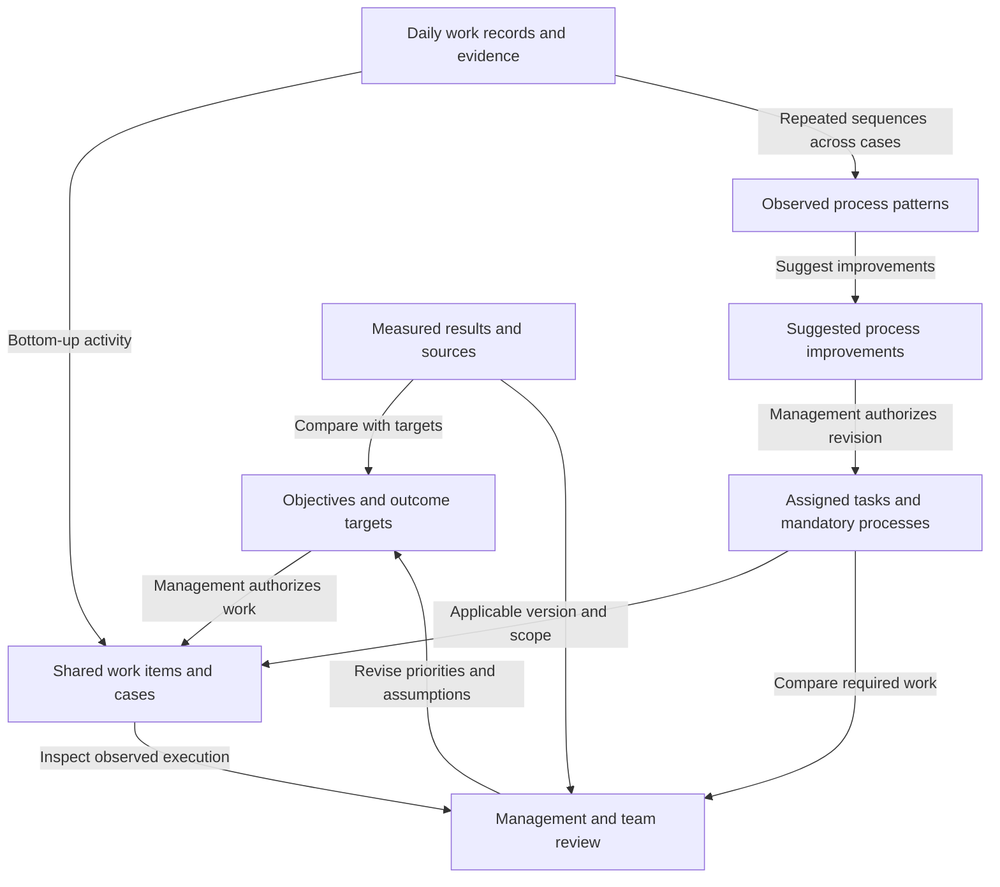

# Work Alignment Framework

Version 0.6 · 2026-09-22 · Workwork Cloud product design proposal

Purpose: connect management's goals with employees' daily work in manufacturing SMBs, including companies without formal workflow systems. This develops the founder's confirmed work-log, process-discovery, KPI, and OKR direction. It defines the conceptual framework for the private `wilcoco/workwork-cloud` repository. The new product has its own application, database, storage, secrets and deployment. The existing FDE and Workwork repositories, running services and production data remain unchanged. Development examples use synthetic data.

Operating-experience update: the founder reports that employee mapping and process-definition tasks are not adopted. Automatic objective/work/result association and observed-process generation are core requirements. Management may also prescribe tasks and mandatory processes as an explicit top-down input. The system handles supported mappings automatically, preserves uncertainty, and offers optional correction. Review queues below are service-quality mechanisms; employees must not be required to classify their records or approve each relationship. The [Compact SaaS Plan](COMPACT-SAAS-PLAN.md) specifies this interaction requirement.

## Input-to-output contract

> Management provides objectives, assigned work and required processes; metric owners provide measurement definitions and actuals; employees provide daily work evidence. The service compares required work with observed work, discovers processes, and compares targets with measured outcomes.

The founder has specified three input groups and two principal outputs. The definitions below make that product concept concrete; customer value and accuracy still require pilot validation.

### Three input groups

| Input | Who provides it and when | Minimum information | What it enables |
|---|---|---|---|
| Management direction and operating requirements | Authorized management at setup or when expectations change, with versioned revisions | Objectives/OKRs and targets; assigned tasks with responsibility, expected output and timing; mandatory processes with applicable scope, triggers, required steps and evidence conditions | Define desired outcomes and prescribed work/processes. These are distinct expectation types; an operating requirement need not have an OKR |
| Performance measures through KPIs | Management or metric owner configures them; the responsible owner updates actuals at the agreed cadence | Metric definition/formula, unit, scope, period, target or acceptable range, direction of improvement, actual-data source | Monitor performance and make a comparable target-versus-actual calculation |
| Daily work records and results | Employees record activities; existing records can also supply facts | Work-item/order reference when known, activity, occurrence time, output or status, blocker/handoff, evidence; relevant measurable facts when available | Connect work, identify recurring sequences, and supply outcome observations where the data is sufficient |

“Company objectives in KPI format” is refined here to “company performance measures and targets.” An objective states the intended outcome; a KPI measures performance. An OKR includes an objective and measurable key results. A key result can use an existing KPI, so users should reuse one metric definition and one set of actual observations. Different purposes or periods may have different explicit target versions.

**Actual outcomes are required data.** A narrative such as “followed up with the supplier” cannot establish an on-time delivery rate. Preserve three user-facing input groups by letting actual measurements come from:

- Structured facts recorded with work, such as an order's agreed due date and actual delivery date.
- A metric owner's dated entry, with the source and scope of the measurement.
- An imported or connected record, when that source is available.

These are alternative ways of supplying actuals, not a requirement to build every integration for the first release. The system chooses an agreed source for each metric and resolves duplicates or conflicting values instead of adding every copy together. Missing actuals produce “not measurable yet,” not estimated achievement from log counts.

The employee's initial interaction stays short: “What did you do, and what happened?” They can mention a job where known. Identity and entry time come from the session; actual work time remains correctable. The service extracts case references, activities and results. Accept incomplete entries, show coverage limitations, and resolve ambiguity in the background or through optional correction; do not require a formal process or forced goal link.

**Accepted capture refinement:** add optional Related work, Result/output and Next dependency context, with **Continue this work** as the first pilot improvement. Inherit a case reference when entry begins from its existing log/request; otherwise suggest supported matches. A shared product/model name is not a unique case. Reuse activity status; capture actual time and measurement details only when relevant. Apply extracted context per activity in a mixed daily log. See [Work context and organizational memory](WORK-CONTEXT-AND-MEMORY.md) for interaction and evidence rules.

### Two principal outputs

| Output | What the customer receives | Basis and limits |
|---|---|---|
| Process and execution review | Automatically generated steps, roles, handoffs, variants and timing, compared with applicable assigned work and prescribed processes when available | Link observed patterns and comparison findings to cases, source records and requirement versions; expose insufficient evidence. Management may prescribe a process before observations exist. Generated patterns do not automatically change requirements |
| Target-versus-actual review | For each KPI/KR: target, actual, gap, period, source, data freshness/coverage, and relevant work or blockers | Requires comparable measurements using the same definition, scope, and period. Relevant work helps investigation but does not establish the cause of a gap |

The service may propose follow-up actions, but its core deliverables remain these two outputs. An execution-record gap from the reconciliation groups below is distinct from a business-outcome gap. If management has supplied only an outcome target, the service cannot claim a specific task was omitted unless a task expectation or approved process also exists.

For a numeric measure, display `actual - target` in the metric's units and interpret the sign using the desired direction. For an on-time rate, actual 92% against target 95% is a 3 percentage-point shortfall. For a defect rate, actual 3% against a maximum 2% is 1 percentage point above the limit. Range targets need a range-specific assessment. Keep unavailable measurements separate from zero.

For an unfinished period, show interim actuals and label any comparison with the final target as interim. An “on track” judgment requires an agreed trajectory or forecast; it does not follow automatically from that difference. Do not combine unrelated KPI gaps into one score without an explicit, reviewed model.

### Hypothetical manufacturing walkthrough

1. **OKR input:** Objective: improve delivery reliability. Key result: increase monthly on-time delivery from an 85% baseline to at least 95% in the target month.
2. **KPI input:** On-time delivery rate = orders delivered by their agreed deadline divided by eligible orders due in the month. Set the eligibility/cancellation rule, owner, period, and data source before calculation. An eligible order still undelivered after its deadline is not on time.
3. **Work input:** Employees record order references, material checks, shortages, supplier follow-ups, production releases, and delivery confirmations. Delivery records provide agreed deadlines and actual delivery dates. The eligible order list is also available, so missing logs do not silently remove orders from the denominator.
4. **Process output:** Across repeated cases, the service automatically generates a flow from material check through production release to delivery confirmation, with supplier follow-up shown as a shortage-related variant. Every observed step links to source records; optional corrections improve future versions.
5. **Gap output:** In the illustrative completed target month, 92 of 100 eligible orders were delivered on time: actual 92%, target 95%, shortfall 3 percentage points. The review links late orders and related records. Shortage-related activity is a possible explanation to investigate, not a proven cause from this calculation alone.

### Acceptance checks for a prototype

- Management can enter one OKR and its KPI once, sharing the underlying metric and avoiding duplicate actual entry.
- An employee can submit work without a predefined process; uncertain case links remain reviewable.
- A discovered process step can be traced back to the supporting cases and work records.
- The target-versus-actual calculation can be reproduced from its source values, period, scope, and formula.
- With no usable actuals or denominator, the output identifies the missing data instead of displaying a fabricated gap or achievement score.
- Management can inspect observed processes and outcome gaps without confusing logged activity, confirmed completion, and measured performance.

## 1. Four core concepts

| Concept | Question | Minimum content | Manufacturing example |
|---|---|---|---|
| Goal | What should improve or be maintained? | Desired outcome or performance requirement, owner, period; metric definition, baseline where relevant, target, assessment rule | Raise on-time delivery from 85% to 95% this quarter |
| Work item | What identifiable work are we talking about? | Stable ID, bounded scope, business reference; owner, expected output and timing when known | Material readiness check for production order 1042 |
| Work record | What actually happened? | Actor, activity, occurrence time, output/status, work-item link or pending match; supporting evidence when available | Buyer confirmed a shortage and contacted the supplier |
| Result | What did we measure? | Metric ID, observed value, unit, period or time, population, source, verification state | 92 of 100 eligible orders delivered on time this month |

These are connected concepts with distinct responsibilities, not four mutually exclusive categories of work. A daily narrative may mention all four; its statements should be linked to the appropriate records rather than forcing the whole narrative into one category.

Evidence attaches to a claim or measurement. An observed process is a pattern across work records and cases; a prescribed process is a versioned management requirement that can exist before any observations; a suggested process is a proposed improvement. Keep these models distinct. Assigned tasks are work items with authorized expectations. People, teams, orders, equipment, files, and permissions provide context. They are not additional mandatory setup stages employees must complete to log work.

An OKR's desired target belongs with the goal; its observed value belongs with results. The same metric can support an ongoing KPI and a time-bound key result without creating duplicate measurements. A relevant activity is not automatically a measurement of business success.

## 2. The meeting point is the work item

A work item may originate from management's plan or from an employee's record of unplanned work. It does not require an existing process or an OKR link. The system automatically matches sufficiently supported identities; uncertain identity remains visible as a coverage limitation and can be resolved by later evidence or optional correction.

For a small company, an employee can describe what they did and what happened, mentioning a job where known. The system extracts structured records and associations without requiring per-record mapping confirmation. A daily log is an entry interface; it may contain multiple activities relating to different work items.

Use a consistent reporting level. Do not count an order, its three tasks, and five daily entries as nine equivalent work items. A business-case reference connects related tasks; a selected report counts either cases or tasks, with a clear rule.

## 3. Apply MECE to reconciliation

MECE means mutually exclusive and collectively exhaustive: each member of a defined population appears in one category, and all members are covered. It does not require every real business relationship to form a tree. [McKinsey / Barbara Minto](https://www.mckinsey.com/alumni/news-and-events/global-news/alumni-news/barbara-minto-mece-i-invented-it-so-i-get-to-say-how-to-pronounce-it)

First select the company/team, reporting period, work-item level, and plan version. Resolve identities and links. Then define:

- **P:** work items registered as expected to receive activity in the selected period, including standing operational requirements.
- **A:** work items with captured activity that occurred in that period, regardless of when the entry was submitted.
- **U = P ∪ A:** resolved, registered work covered by the comparison.

| Reconciliation state | Rule | Meaning | Appropriate review |
|---|---|---|---|
| Expected, with records | P ∩ A | Expected work has some recorded activity | Inspect completion, blockers, evidence, and results separately |
| Expected, without records | P minus A | No corresponding activity has been captured | Check missing reporting, access, changed priorities, or non-execution |
| Recorded, without an expectation | A minus P | Activity exists outside the registered expectations | Check necessary operations, incidents, emerging needs, or planning omissions |

The three sets have no overlap and their union is U. There is no fourth “neither expected nor recorded” category inside U: such work is outside the platform's current visibility.

**This is exhaustive for resolved, registered work in scope, not for everything employees actually did.** Missing records must not be presented as proof that no work occurred. A match establishes recorded activity, not completion, quality, compliance, or goal achievement.

### Unresolved records

Maintain a separate queue for uncertain work-item identity, ambiguous matches, missing dates, or unclear expectations. Do not add the number of raw entries in this queue to the number of resolved work items: several entries may describe the same job.

When an ambiguous record might belong to an expected item, flag that item's apparent absence as provisional. Withhold affected percentages until the ambiguity is resolved, or explicitly show that the figures are provisional. Show queue size, age, and resolution progress separately.

### Plans change

Preserve the expectation version and when it was approved. Later approval of emergency work must not rewrite whether it was expected at the original review point. Maintain both the original baseline and the current agreed plan. Cancelled or out-of-period items follow an explicit scope rule rather than silently appearing as missed work.

## 4. Keep other questions on separate axes

Reconciliation, completion, evidence, goal association, and outcome assessment answer different questions. Store and display them separately.

| Axis | Proposed treatment |
|---|---|
| Goal association | Automatically apply zero, one, or several supported links with provenance; preserve uncertain candidates separately and allow optional correction. Necessary operations need not have an OKR |
| Completion | Separate reported activity completion, output/result and acceptance. Apply explicit acceptance only where the case requires it; do not require approval of every ordinary work log |
| Evidence | Show the claim, attached sources, and review state; attachment is not verification |
| Outcome assessment | Meets target / misses target / not assessable, according to a defined metric, period, and decision rule |
| Process | Keep prescribed requirements, observed patterns and suggested improvements separate; evaluate applicable version/scope and any authorized exceptions |

Do not classify work as “strategic / routine / urgent” and call that MECE. An urgent maintenance task can be routine and support a strategic goal at the same time. These are separate attributes.

Count each work item once in company totals. Goal-level views may overlap when work supports multiple goals; label them accordingly. If additive effort totals are needed, use explicit allocations that sum to 100% of the recorded effort. Do not infer effort from log counts or activity timestamps, and do not treat an effort allocation as causal credit for a business result.

Goals with no linked work items remain visible as a separate planning question. Measured results without relevant work records remain visible too. Neither should be invented into a task just to fill the reconciliation table.

## 5. Process discovery within the framework

1. Link records to identifiable work items and business cases.
2. Normalize activity names while retaining original text and evidence.
3. Compare sequences across repeated cases, including handoffs and exceptions.
4. Present a proposed process with its supporting records and coverage limitations.
5. Publish an automatically generated process view with evidence coverage; allow optional corrections. Agreement on a future operating standard is separate from generating the observed map.

Process mining commonly relies on case identifiers, activity names, and occurrence timestamps. Narrative-only records can suggest patterns but cannot establish reliable sequences on their own. [Microsoft process-mining data requirements](https://learn.microsoft.com/en-us/power-automate/process-mining-processes-and-data)

Recurring processes can exist without strategic goal links. Some work remains one-off. Management can prescribe mandatory processes before any records exist; the service can also suggest improvements from observations. Neither path makes employee process-definition work a prerequisite for logging. Missing expected evidence is distinct from demonstrated deviation, and adherence is distinct from achievement of the business target.

### Maintain the interpretation over time

New logs, replies, measurements and authorized corrections update the relevant shared case and its derived process/goal views. Preserve the original source revision and record which interpretations depend on it. Recompute affected views when evidence changes; expose unresolved contradictions, stale facts and missing measurements. Permission changes and deletion/retention rules must also propagate to derived views and retrieval.

This persistent interpretation forms organizational memory behind Work, Goals and Review. Generated summaries can explain evidence and suggest reusable patterns; they cannot create authoritative completion, accepted responsibility, approval rights or a numeric outcome. Distinguish historical observations, present case state and proposed next work. Relevant analyses may be saved for reuse with their evidence references and freshness, without a separate employee wiki-maintenance task.

The LLM Wiki comparison is documented with its original source in [Work context and organizational memory](WORK-CONTEXT-AND-MEMORY.md). It informs knowledge maintenance; the four core concepts and two principal product outputs remain unchanged.

## 6. Walk through representative cases

| Case | Treatment |
|---|---|
| Planned quality inspection, with inspection records | Expected, with records; acceptance and quality result remain separate |
| Planned inspection, no captured activity | Expected, without records; investigate before inferring non-execution |
| Emergency machine repair absent from the plan | Recorded, without an expectation; preserve its operational value and original timing |
| Scheduled maintenance without an OKR | Expected operational work; no invented strategic link needed |
| One improvement task supports delivery and quality goals | One work item, two goal associations; no duplicate company count |
| Three employees record contributions to the same job | Three distinct activity records, one work item; distinguish shared result from individual activity |
| “Helped production today,” with no identifiable job | Accept the entry; retain unresolved identity internally, show limited coverage, and use later evidence or optional clarification |
| Recorded task has no attachment | Still recorded activity, shown as self-reported with missing supporting evidence |
| Task completed but delivery KPI deteriorated | Preserve both observations; completion does not establish business impact |
| Manager creates a goal but no plan or work records | Show an undeveloped priority outside the work-item reconciliation counts |
| Work was neither expected nor recorded | Outside current visibility; do not claim complete coverage of actual work |

These examples are design checks, not pilot validation or automated software tests.

## 7. Compact first product

Three user views can expose the four concepts:

- **Work:** relevant authorized assignments, quick logging, automatically extracted work items and links, evidence, and useful daily summaries.
- **Goals:** objectives, management operating requirements, performance measures, targets and actual-data sources.
- **Review:** automatically generated process maps, comparison with applicable required work/processes, and outcome gaps. Coverage limitations remain visible; resolving an employee classification queue is not a condition for using the service.

The first product should support this loop before adding a universal workflow designer. Implement independent work logs, stable work-item links and sourced metric observations in the new Workwork Cloud application. Any reused source components are copied, adapted and verified only in the new repository. This framework does not authorize changes or migrations to the existing services; the [Compact SaaS Plan](COMPACT-SAAS-PLAN.md) defines the independent build scope.

The measurement distinction is consistent with Microsoft's guidance separating objectives, measurable key results, and initiatives. The four-concept model and reconciliation rules above are this project's proposal, not a framework endorsed by that source. [Microsoft OKR guidance](https://learn.microsoft.com/en-us/viva/goals/viva-goals-healthy-okr-program/write-okrs-overview)

Related: [Compact SaaS Plan](COMPACT-SAAS-PLAN.md).
